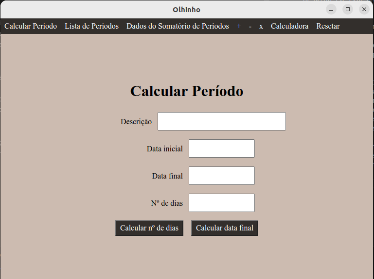

# Olhinho

Olhinho é uma aplicação desktop para cálculo de datas. Também tem a versão executável no navegador e também está disponível na web através do endereço <a href="https://olhinho.netlify.app">olhinho.netlify.app</a>. Tem como objetivo auxiliar equipes de RH de órgãos públicos na elaboração de mapas de tempó de serviço.

</img>

## Funcionalidades

### Calcular Período:

O usuário deve inserir uma data inicial e pode inserir uma data final para calcular o número de dias do período, ou inserir o número de dias para calcular a data final. O período inclui tanto a data inicial como a data final.

 Quando o usuário tem as três informações mencionadas na tela, ele pode inserir esse período na lista de período como período a ser adicionado ou a ser descontado.

O usuário também pode inserir uma descrição, se tiver o objetivo de se situar melhor na lista de períodos

Esta funcionalidade pode ser acessada pelo menu ou pelo atalho "Alt c".

### Listar Períodos:

O programa exibe para o usuário uma tabela com períodos com informação de descrição, data inicial, data final e número de dias. Se o período for um desconto, aparece com sinal negativo. Esta tabela também dá acesso às funcionalidades de atualizar período e excluir período.

Esta funcionalidade pode ser acessada pelo menu ou pelo atalho "Alt l".

### Exibir dados do Somatório de Período:

Exibe os seguintes dados relativos à lista de período:
<li>Total em dias: a soma dos dias, somando os períodos acrescidos e subtraindo os descontos.</li>
<li>Soma: a soma dos dias dos períodos inseridos na lista como acréscimos.</li>
<li>Descontos: a soma dos dias dos períodos inseridos na lista como desconto.</li>
<li>Total em anos: mostra o total em dias contanto quantos anos, meses e dias esse total tem. Se o total em dias for 1827, o total em anos vai ser "5 anos, 0 mês e 2 dias".</li>
<li>Total em anos por extenso: mostra o total em anos por extenso. Se o total em dias for 1827, aqui vai ser mostrado "Mil, oitocentos e vinte e sete dias".</li>

Esses dados são copiáveis para editores como Microsoft Word ou LibreOffice Writer.

Esta funcionalidade pode ser acessada pelo menu ou pelo atalho "Alt d". O atalho está disponível apenas na versão desktop.

### Somar (+) / Subtrair (-) / Multiplicar (x):

Operações que podem ser feitas sobre o total em dias da lista de período. Serve para quando o usuário quer acrescentar ou subtrair dias sem informar data inicial.

Estas funcionalidade pode ser acessada pelo menu.

Os seguintes atalhos acessam essas funcionalidades:
<li>Atl +: somar</li>
<li>Atl -: subtrair</li>
<li>Atl x: multiplicar</li>

### Calculadora:

Uma simples calculadora numérica com as operações somar, subtrair e multiplicar dois números.

Esta funcionalidade pode ser acessada pelo menu ou pelo atalho "Alt n".

### Atualizar período:

Abre a tela de cálculo de período em modo de atualização. As diferenças em relação à funcionalidade de cálculo de período é que, aqui, os dados do período aparecem em seus respectivos campos e os botões "Somar na Lista" e "Descontar na Lista" não criam período novo, mas atualizam os dados do período editado.

Esta funcionalidade deve ser acessada através da tela de Lista de Períodos. Cada período tem seu respectivo botão para atualização.

### Excluir período:

Exibe a lista de dados do período e pergunta se o usuário quer mesmo excluiir o período.

Esta funcionalidade deve ser acessada através da tela de Lista de Períodos. Cada período tem seu respectivo botão para exclusão.

### Resetar:

Exclui todos os períodos e direciona para a tela de Cálculo de Períodos. Pode ser acessado pelo menu ou pelo atalho F5.

## Motivação:

O autor, no momento da criação deste app, trabalha em setor de RH de órgão público, ajudando na construção de processos de aposentadoria, abono de permanência, licenças-prêmio e outros processos que requerem contagem de tempo de funcionário. 

Existe uma aplicação chamada "Calcular data", cujo símbolo é um olhinho azul e possui boa parte das funcionalidades deste app e é uma aplicação muito utilizada pela nossa equipe. Mas não permite descrição de períodos, edição de períodos, exclusão de períodos, nem cópia de dados referentes ao total de dias.
